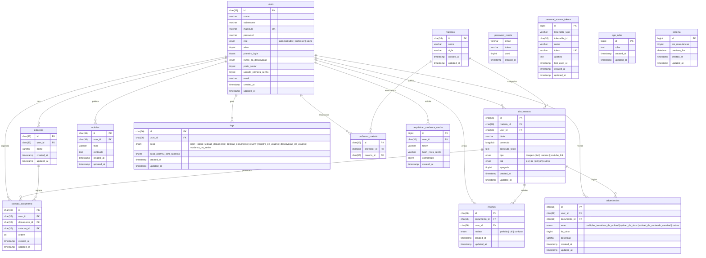

# Diagrama Entidade-Relacionamento (DER)

```mermaid
erDiagram

    users {
        char(36)    id PK
        varchar     nome
        varchar     sobrenome
        varchar     matricula UK
        varchar     password
        enum        role "administrador | professor | aluno"
        tinyint     ativo
        tinyint     primeiro_login
        enum        razao_da_desativacao
        tinyint     pode_postar
        tinyint     usando_primeira_senha
        varchar     email
        timestamp   created_at
        timestamp   updated_at
    }

    materias {
        char(36)    id PK
        varchar     nome
        varchar     sigla
        timestamp   created_at
        timestamp   updated_at
    }

    documentos {
        char(36)    id PK
        char(36)    materia_id FK
        char(36)    user_id FK
        varchar     titulo
        longblob    conteudo
        text        conteudo_texto
        enum        tipo "imagem | txt | readme | youtube_link"
        enum        tag "p1 | p2 | p3 | pf | outros"
        tinyint     apagado
        timestamp   created_at
        timestamp   updated_at
    }

    colecoes {
        char(36)    id PK
        char(36)    user_id FK
        varchar     nome
        timestamp   created_at
        timestamp   updated_at
    }

    colecao_documento {
        char(36)    id PK
        char(36)    user_id FK
        char(36)    documento_id FK
        char(36)    colecao_id FK
        int         ordem
        timestamp   created_at
        timestamp   updated_at
    }

    reviews {
        char(36)    id PK
        char(36)    documento_id FK
        char(36)    user_id FK
        enum        review "perfeito | util | confuso"
        timestamp   created_at
        timestamp   updated_at
    }

    advertencias {
        char(36)    id PK
        char(36)    user_id FK
        char(36)    documento_id FK
        enum        acao "multiplas_tentativas_de_upload | upload_de_virus | upload_de_conteudo_sensivel | outros"
        tinyint     foi_visto
        varchar     descricao
        timestamp   created_at
        timestamp   updated_at
    }

    noticias {
        char(36)    id PK
        char(36)    user_id FK
        varchar     titulo
        text        conteudo
        timestamp   created_at
        timestamp   updated_at
    }

    logs {
        char(36)    id PK
        char(36)    user_id FK
        enum        acao "login | logout | upload_documento | delecao_documento | review | registro_de_usuario | desativacao_de_usuario | mudanca_de_senha"
        tinyint     acao_ocorreu_com_sucesso
        timestamp   created_at
        timestamp   updated_at
    }

    professor_materia {
        char(36)    id PK
        char(36)    professor_id FK
        char(36)    materia_id FK
    }

    requisicao_mudanca_senha {
        bigint      id PK
        char(36)    user_id FK
        varchar     token
        varchar     hash_nova_senha
        tinyint     confirmado
        timestamp   created_at
    }

    password_resets {
        varchar     email
        varchar     token
        tinyint     used
        timestamp   created_at
    }

    personal_access_tokens {
        bigint      id PK
        varchar     tokenable_type
        char(36)    tokenable_id
        varchar     name
        varchar     token UK
        text        abilities
        timestamp   last_used_at
        timestamp   created_at
        timestamp   updated_at
    }

    app_rules {
        bigint      id PK
        text        rules
        timestamp   created_at
        timestamp   updated_at
    }

    sistema {
        bigint      id PK
        tinyint     em_manutencao
        datetime    previsao_fim
        timestamp   created_at
        timestamp   updated_at
    }

    users ||--o{ documentos            : "publica"
    users ||--o{ colecoes              : "cria"
    users ||--o{ colecao_documento     : "organiza"
    users ||--o{ reviews               : "avalia"
    users ||--o{ advertencias          : "recebe"
    users ||--o{ noticias              : "publica"
    users ||--o{ logs                  : "gera"
    users ||--o{ professor_materia     : "leciona em"
    users ||--o{ requisicao_mudanca_senha : "solicita"

    materias ||--o{ documentos         : "categoriza"
    materias ||--o{ professor_materia  : "associada a"

    documentos ||--o{ colecao_documento : "pertence a"
    documentos ||--o{ reviews           : "recebe"
    documentos ||--o{ advertencias      : "origina"

    colecoes ||--o{ colecao_documento   : "agrupa"
```